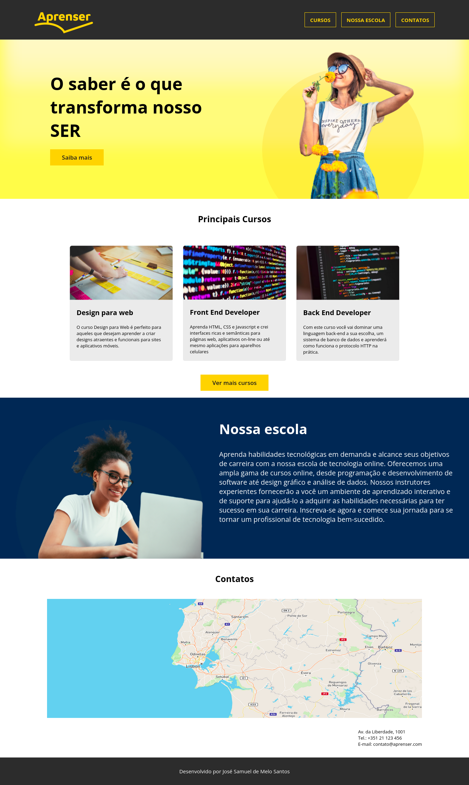

# Aprenser - Escola de Tecnologia

Um website moderno e envolvente para uma escola de tecnologia online, focado em apresentar os principais cursos e a filosofia da escola.

## 🌟 Visão Geral do Projeto

O projeto **Aprenser** é o layout de uma landing page para uma escola de cursos de tecnologia. O design é vibrante, utilizando uma paleta de cores escuras e amarelo (azul marinho, preto e amarelo-ouro) para transmitir profissionalismo e energia. O foco principal é a **conversão** para os cursos de **Desenvolvimento Web** e a **apresentação da escola**.

## 🛠️ Tecnologias Utilizadas

* **HTML5:** Estrutura e semântica do site.
* **CSS3:** Estilização, layout e design.
    * **Variáveis CSS (`:root`):** Utilizadas para gerenciar a paleta de cores (amarelo, azul, dark) e facilitar a manutenção.
    * **Flexbox:** Aplicado para alinhar itens no header e na apresentação dos cursos.
    * **Google Fonts:** Utilização da fonte 'Open Sans' para garantir leitura agradável e profissionalismo.
    * **`position: sticky;`:** Usado no cabeçalho para mantê-lo visível durante a navegação.

## ✨ Imagem do Site
